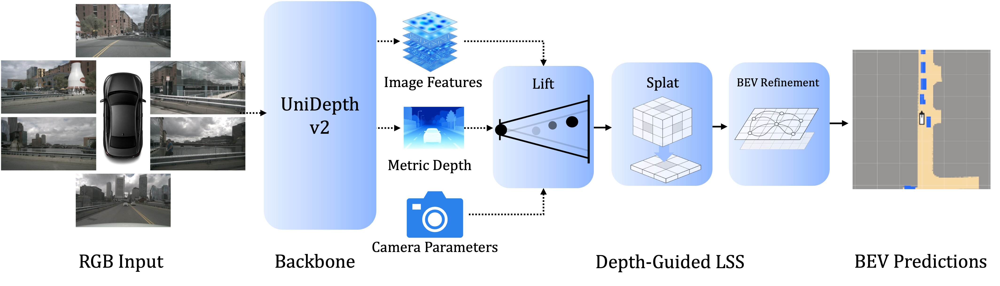
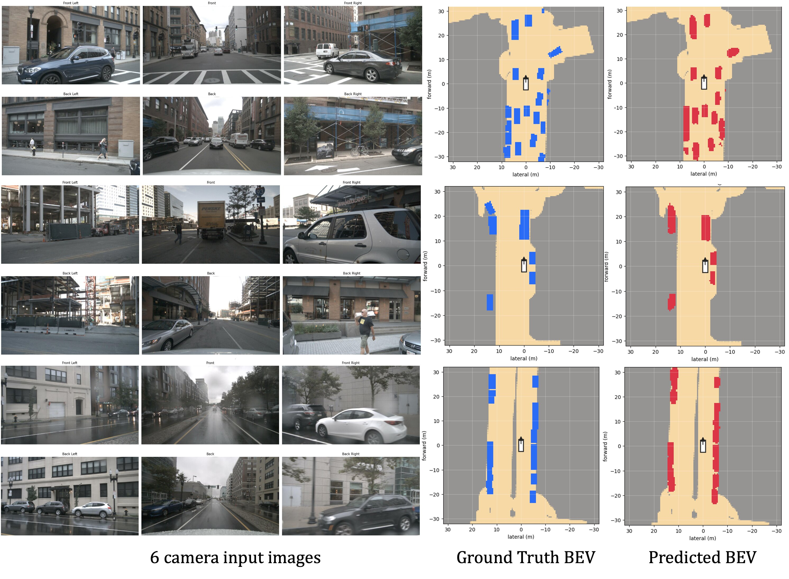

# UniDepth-LSS

Camera-only bird's-eye-view vehicle segmentation on nuScenes, using frozen metric depth priors
from **UniDepthV2** to guide Lift-Splat-Shoot feature lifting.

This is an adaptation of the authors' [public code
release](https://github.com/adeelmhr/UniDepth-LSS) for *UniDepth-LSS: Depth Foundation Model
Priors for Camera-Only BEV Perception* (DriveX Workshop @ ECCV 2026) onto this team's training
infrastructure: `uv` packaging, Hydra config, PyTorch Lightning, Docker + Slurm.

## Read this before quoting a number

**The released configuration is not evaluated on the same BEV window as the baselines it is
compared against.** The release uses a 128 x 128 grid at 0.5 m — a **64 x 64 m** window
(±32 m). Every camera-only baseline in the paper's Table 1 (CVT, LSS, BAEFormer, BEVFormer,
GaussianLSS, Simple-BEV, PointBeV, GaussianBEV) reports Vehicle IoU over the standard CVT/LSS
"Setting 1" window: 200 x 200 at 0.5 m, i.e. **100 x 100 m**.

That is 41% of the area, and the excluded 32–50 m ring is exactly where camera-only depth
degrades and vehicles are small, distant and often occluded. Those vehicles leave both the true
positives and the false negatives, which inflates IoU.

This repo therefore ships **both** windows as first-class config, defaults to the comparable
one, and provides a tool that scores the same weights under both in a single command:

```bash
uv run tools/eval.py checkpoint_path=checkpoints/UniDepthLSS.pt
```

Measured, with the authors' own released weights on 6,019 val samples at 448x798:

| window | extent | Vehicle IoU (no filter) | Vehicle IoU (vis ≥ 2) |
|---|---|---|---|
| `paper` (128x128) | 64 x 64 m | 49.40% | 52.85% |
| `standard` (200x200) | 100 x 100 m | 18.24% | 19.25% |

The first row reproduces the published 49.4 / 52.8 to five decimal places — the acceptance
gate for this port. **The second row is zero-shot window transfer, not the method's
score at the standard setting** — the checkpoint was trained on the smaller window, so the
32–50 m ring was never in its training target. It establishes that the published comparison is
not like-for-like; it does not establish what the method would score if trained properly at
200x200. That needs a retrain. Details and caveats: [`docs/baseline.md`](docs/baseline.md).

Speed and memory: [`docs/efficiency.md`](docs/efficiency.md). Other findings from the port —
including a backbone freeze that does not hold in the committed code — are in `CLAUDE.md`.

## Architecture

<p align="center">
  
</p>

A frozen UniDepthV2 ViT-L extracts metric depth and image features from the six surrounding
cameras. The depth guides the lifting of each feature cell to a single 3D point, the camera
calibration maps those points into the ego frame, they are pooled into a BEV grid, and a
lightweight transformer plus a convolutional head produce the vehicle segmentation. Only the
feature adapter, the BEV transformer and the head are trained.

<p align="center">
  
</p>

<p align="center">
  <em>Ground truth (middle) and prediction (right) for the six camera views on the left.
  Figures from the authors' original release.</em>
</p>

## Setup

Docker is the supported workflow — everything runs through `uv` inside the container.

```bash
export NUSCENES_DATA_ROOT=/path/to/nuscenes
export WANDB_API_KEY=...        # optional; use logger=csv without it
export HF_TOKEN=...             # optional

make build
make run                        # mounts $NUSCENES_DATA_ROOT at /data/nuscenes
```

One-time, inside the container:

```bash
uv run tools/download_checkpoints.py --all   # pretrained weights
uv run tools/build_calibration_sidecar.py    # only if using the fast data path (see Data)
```

### Pretrained weights

Two sets, and only one needs anything from you:

| | size | how |
|---|---|---|
| UniDepthV2 ViT-L backbone (frozen) | ~1.4 GB | **automatic** — pulled from HuggingFace on first model construction, cached under `$HF_HOME` |
| UniDepth-LSS head weights (released v1.0) | 16.9 MB | `uv run tools/download_checkpoints.py` — a GitHub release asset, so nothing fetches it implicitly |

The head weights are needed to **evaluate, benchmark or visualize** the published model, and are
**not** needed to train from scratch. `tools/eval.py` fetches them automatically if
`checkpoint_path` points at `checkpoints/UniDepthLSS.pt` and it is missing; any other missing path
is treated as an error rather than silently substituted. The download is digest-pinned — every
number in `docs/baseline.md` was measured against that exact file — and `--all` also pre-warms the
backbone cache, which is worth doing before submitting a cluster job.

## Commands

```bash
# train -- 200x200 @ 100 m, the comparable window
uv run tools/train.py

# train under the released window instead
uv run tools/train.py data/bev=paper

# multi-GPU: Lightning owns process spawning, so there is no torchrun wrapper
uv run tools/train.py trainer.devices=2

# evaluate a checkpoint under both windows at once
uv run tools/eval.py checkpoint_path=/path/to/best.ckpt

# fetch/verify pretrained weights (idempotent)
uv run tools/download_checkpoints.py --check

# inspect a finished run without importing torch
uv run dev/analyze_run.py

# qualitative BEV figures (opens notebooks/visualize.ipynb)
make jupyter

# re-measure precision/compile choices
uv run dev/compile_bf16_sweep.py checkpoint_path=checkpoints/UniDepthLSS.pt \
    compile_stages=backbone num_repeats=3
```

Shipped speed defaults are `trainer.precision=bf16-mixed` and `compile_stages=backbone`:
**94.1 ms/sample, 10.6 Hz, 3153 MB** against 281.2 ms / 3.6 Hz / 5977 MB for fp32 eager — 2.99x
faster, 47% less memory, and no measurable accuracy cost (Δ IoU = 2.7e-5).

Sanity checks, none of which need a full training run:

```bash
uv run dev/check_instantiate.py           # every config combination builds
uv run dev/check_backbone_freeze.py       # what strict_freeze does, and why it exists
uv run dev/capture_forward_reference.py --check docs/forward_reference.json
uv run dev/check_store_parity.py          # store vs devkit labels
uv run dev/check_dataset_parity.py        # full sample-level dataset parity
```

## Data

Two interchangeable sources, selected with `data.source`:

- **`store`** (default) — reads the offline nuScenes store that the sibling repos have already built,
  plus a 0.9 MB calibration sidecar from `tools/build_calibration_sidecar.py`.
- **`devkit`** — reads nuScenes live through `nuscenes-devkit`.

`dev/check_dataset_parity.py` verifies that the two produce identical images, intrinsics,
extrinsics, segmentation and visibility. The default is `store` purely for memory: the devkit forks an ~8 GB
in-memory index into every dataloader worker, which caps `num_workers` at 2. **If you switch to
`data.source=devkit`, drop `data.num_workers` to 2.**

The store holds labels and calibration only. The frozen UniDepthV2 ViT-L runs inside the network
on every step and its features are never written to disk — that is the published method, and a
ViT-L feature store over 34k samples x 6 cameras is not affordable here.

## Notes on this adaptation

- **`uv.lock` is not tracked**, matching the reference repo. `pyproject.toml` pins the versions
  that matter — `torch==2.8.0` from the cu129 index, UniDepthV2 at an exact commit, and the
  `numpy<2` override — so a fresh `uv sync` resolves to the stack the numbers in
  `docs/baseline.md` were produced with. Keep a copy of the lockfile alongside any result you
  intend to defend.
- **UniDepthV2 is a pinned git dependency** (`[tool.uv.sources]`, rev `8d8cfe4`), not vendored.
  Its `numpy>=2.0.0` pin is overridden to `<2` — the authors' own `environment.yml` shipped
  `numpy==1.26.4`, so that is the validated combination. `xformers`, `torchaudio` and `gradio`
  are resolved away; none is imported on the UniDepthV2 path.
- **`torch_scatter` was dropped.** The released code already shipped a pure-torch `index_add_`
  fallback and called the dependency optional, so this is the path that produced the published
  numbers.

## Acknowledgements

Builds on [Lift-Splat-Shoot](https://github.com/nv-tlabs/lift-splat-shoot) and
[UniDepth](https://github.com/lpiccinelli-eth/UniDepth). Pretrained UniDepth-LSS weights come
from the authors' [v1.0 release](https://github.com/adeelmhr/UniDepth-LSS/releases/tag/v1.0).

## Citation

```bibtex
@inproceedings{hafeez2026unidepthlss,
  title     = {UniDepth-LSS: Depth Foundation Model Priors for Camera-Only BEV Perception},
  author    = {Hafeez, Muhammad Adeel and others},
  booktitle = {DriveX Workshop at the European Conference on Computer Vision},
  year      = {2026}
}
```
